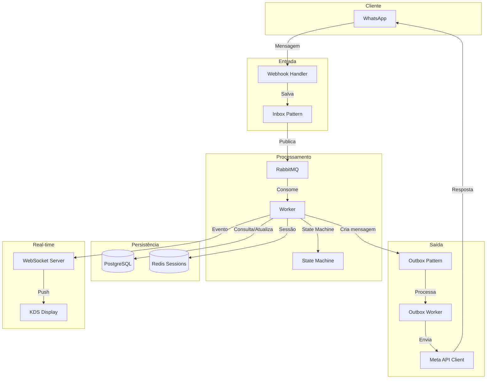
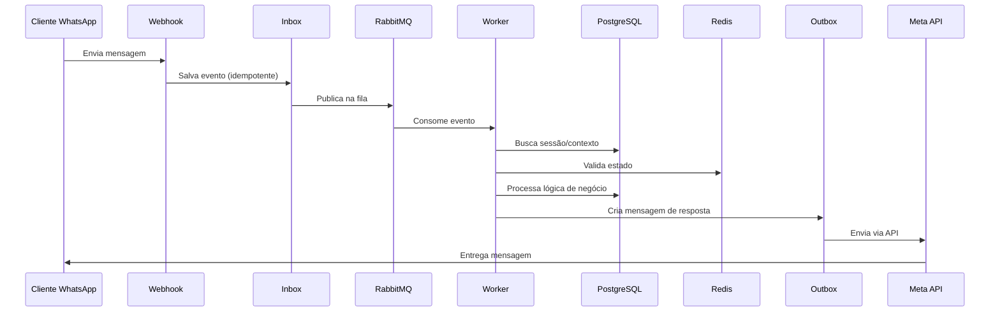
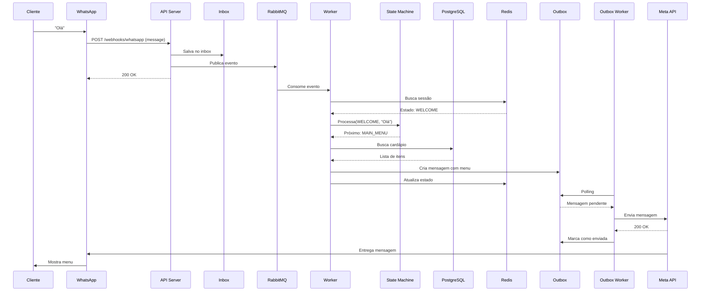

# ClickGarçom - Arquitetura Completa 🍽️

> **Sistema de pedidos para restaurantes via WhatsApp com KDS em tempo real**

## 📋 Índice

1. [Visão Geral](#visão-geral)
2. [Stack Tecnológica](#stack-tecnológica)
3. [Arquitetura do Sistema](#arquitetura-do-sistema)
4. [Estrutura de Diretórios](#estrutura-de-diretórios)
5. [Componentes Principais](#componentes-principais)
6. [Padrões de Design](#padrões-de-design)
7. [Fluxo de Dados](#fluxo-de-dados)

---

## Visão Geral

O **ClickGarçom** é um sistema completo de gestão de pedidos para restaurantes que utiliza WhatsApp como interface principal para clientes, com um KDS (Kitchen Display System) em tempo real para a cozinha/bar.

### Características Principais

- ✅ **Multi-tenancy**: Suporte para múltiplos restaurantes
- ✅ **WhatsApp Integration**: Recebimento de pedidos via WhatsApp
- ✅ **Real-time KDS**: Display de cozinha em tempo real via WebSocket
- ✅ **Event-Driven**: Arquitetura orientada a eventos com RabbitMQ
- ✅ **Clean Architecture**: Separação clara de responsabilidades
- ✅ **Idempotência**: Inbox/Outbox patterns para confiabilidade
- ✅ **Observabilidade**: Prometheus + Grafana integrados

---

## Stack Tecnológica

### Backend Core (Go)
- **Framework**: [Fiber](https://gofiber.io/) - Web framework de alta performance
- **ORM**: [GORM](https://gorm.io/) - Object-Relational Mapping
- **Migrations**: golang-migrate
- **Logger**: Estruturado com níveis configuráveis

### Infraestrutura
- **Database**: PostgreSQL 17 (Alpine)
- **Cache/Sessions**: Redis 7 (Alpine)
- **Message Broker**: RabbitMQ 3.13 (Management)
- **Containerization**: Docker Compose

### Observabilidade
- **Metrics**: Prometheus
- **Dashboards**: Grafana
- **Logs**: Structured logging

### Integrações
- **WhatsApp**: Meta Business API
- **Payments**: PIX (via PSP)

---

## Arquitetura do Sistema

### Diagrama de Alto Nível



### Fluxo de Requisição



---

## Estrutura de Diretórios

```
clickgarcom/
├── docker-compose.yml          # Orquestração de containers
├── Makefile                    # Comandos de desenvolvimento
├── README.md                   # Documentação principal
│
├── infra/                      # Configurações de infraestrutura
│   ├── docker/
│   │   └── postgres/
│   │       └── init.sql
│   ├── prometheus/
│   │   └── prometheus.yml
│   └── rabbitmq/
│       └── rabbitmq.conf
│
└── services/
    └── go-core/                # Serviço principal em Go
        ├── cmd/                # Entry points
        │   ├── api/           # HTTP API (webhooks)
        │   ├── worker/        # RabbitMQ consumer
        │   ├── outbox-worker/ # Outbox processor
        │   ├── migrate/       # Database migrations
        │   └── setup-rabbitmq/# RabbitMQ setup
        │
        ├── internal/           # Código privado
        │   ├── config/        # Configurações
        │   ├── domain/        # Entidades de domínio
        │   │   ├── inbox/
        │   │   ├── order/
        │   │   ├── tab/
        │   │   ├── table/
        │   │   ├── tenant/
        │   │   └── whatsapp/
        │   │
        │   ├── application/   # Casos de uso
        │   │
        │   ├── infrastructure/# Implementações
        │   │   ├── persistence/
        │   │   │   └── postgres/
        │   │   ├── queue/
        │   │   │   └── rabbitmq/
        │   │   └── whatsapp/
        │   │       ├── meta_api_client.go
        │   │       ├── outbox_processor.go
        │   │       └── sender.go
        │   │
        │   └── interfaces/    # Controllers/Handlers
        │       └── http/
        │
        └── pkg/               # Código público/compartilhado
            └── logger/
```

---

## Componentes Principais

### 1. **API Server** (`cmd/api`)

**Responsabilidade**: Receber webhooks do WhatsApp

```go
// Endpoints principais:
POST /webhooks/whatsapp  // Recebe mensagens do WhatsApp
GET  /webhooks/whatsapp  // Verificação do Meta
GET  /health            // Health check
```

**Características**:
- Validação de assinatura Meta
- Salvamento idempotente no Inbox
- Publicação assíncrona no RabbitMQ
- Resposta rápida (< 5s)

### 2. **Worker** (`cmd/worker`)

**Responsabilidade**: Processar mensagens do WhatsApp

**Fluxo**:
1. Consome mensagem da fila `whatsapp.messages`
2. Busca sessão do usuário no Redis
3. Executa State Machine baseado no contexto
4. Atualiza banco de dados
5. Cria mensagem de resposta no Outbox
6. Emite eventos para WebSocket (se aplicável)

**State Machine**:
```
WELCOME → MAIN_MENU → ORDERING → SELECTING_QTY →
CONFIRMING_ORDER → VIEWING_TAB / CLOSING_TAB / SERVICE_REQUEST
```

### 3. **Outbox Worker** (`cmd/outbox-worker`)

**Responsabilidade**: Enviar mensagens para WhatsApp de forma confiável

**Características**:
- Polling do banco a cada 5 segundos
- Retry exponencial (max 3 tentativas)
- Marca mensagens como enviadas
- Registra erros para análise

### 4. **Realtime Hub** (`cmd/api`)

**Responsabilidade**: WebSocket para KDS em tempo real, hospedado no mesmo processo da API Fiber

**Eventos**:
- `order.created` - Novo pedido
- `order.accepted` - Pedido aceito
- `order.ready` - Pedido pronto
- `order.delivered` - Pedido entregue
- `order.canceled` - Pedido cancelado

### 5. **Migrations** (`cmd/migrate`)

**Migrations disponíveis**:
- `000001_initial_schema.up.sql` - Schema completo
- `000002_fix_outbox_payload.up.sql` - Ajuste no Outbox

---

## Padrões de Design

### 1. **Clean Architecture**

```
┌─────────────────────────────────────┐
│         Interfaces (HTTP/Queue)      │
├─────────────────────────────────────┤
│         Application (Use Cases)      │
├─────────────────────────────────────┤
│         Domain (Entities)            │
├─────────────────────────────────────┤
│    Infrastructure (DB/Queue/APIs)    │
└─────────────────────────────────────┘
```

**Benefícios**:
- Testabilidade
- Independência de frameworks
- Separação de responsabilidades

### 2. **Inbox Pattern** (Idempotência)

**Problema**: Webhooks podem ser enviados múltiplas vezes

**Solução**:
```sql
CREATE TABLE inbox_events (
    id UUID PRIMARY KEY,
    source VARCHAR(50) NOT NULL,
    provider_message_id VARCHAR(255) NOT NULL,
    payload JSONB NOT NULL,
    processed BOOLEAN DEFAULT FALSE,
    UNIQUE(source, provider_message_id)  -- Garante idempotência
);
```

**Fluxo**:
1. Webhook chega
2. Tenta inserir no `inbox_events`
3. Se já existe (UNIQUE constraint), ignora
4. Se novo, salva e publica no RabbitMQ

### 3. **Outbox Pattern** (Confiabilidade)

**Problema**: Garantir que mensagens sejam enviadas mesmo se o serviço cair

**Solução**:
```sql
CREATE TABLE outbox_messages (
    id UUID PRIMARY KEY,
    destination VARCHAR(50) NOT NULL,
    recipient VARCHAR(255) NOT NULL,
    payload TEXT NOT NULL,
    sent BOOLEAN DEFAULT FALSE,
    attempts INT DEFAULT 0,
    max_attempts INT DEFAULT 3,
    next_retry_at TIMESTAMP
);
```

**Fluxo**:
1. Worker cria mensagem no Outbox (mesma transação do pedido)
2. Outbox Worker processa periodicamente
3. Marca como `sent = true` após sucesso
4. Retry exponencial em caso de falha

### 4. **State Machine** (Conversação)

**Gerenciamento de contexto conversacional**:

```go
type ConversationState string

const (
    StateWelcome         ConversationState = "WELCOME"
    StateMainMenu        ConversationState = "MAIN_MENU"
    StateOrdering        ConversationState = "ORDERING"
    StateSelectingQty    ConversationState = "SELECTING_QTY"
    StateConfirmingOrder ConversationState = "CONFIRMING_ORDER"
    // ...
)
```

**Armazenamento**: Redis com expiracao de sessao

### 5. **Repository Pattern**

**Interface**:
```go
type TabRepository interface {
    Create(ctx context.Context, tab *domain.Tab) error
    FindByID(ctx context.Context, id uuid.UUID) (*domain.Tab, error)
    Update(ctx context.Context, tab *domain.Tab) error
    // ...
}
```

**Implementação**: PostgreSQL com GORM

---

## Fluxo de Dados

### Exemplo: Cliente faz um pedido



---

## Database Schema

### Principais Tabelas

#### **tenants**
Multi-tenancy - cada restaurante é um tenant
```sql
- id (UUID)
- name, slug
- whatsapp_number (UNIQUE)
- settings (JSONB)
- active (BOOLEAN)
```

#### **tables**
Mesas do restaurante
```sql
- id (UUID)
- tenant_id (FK)
- number (VARCHAR)
- qr_token (JWT rotacionável)
- status (AVAILABLE, OCCUPIED, RESERVED, CLEANING)
```

#### **tabs**
Comandas abertas
```sql
- id (UUID)
- tenant_id, table_id (FK)
- subtotal, service_fee, total, paid_amount
- status (OPEN, WAITING_PAYMENT, PAID, CLOSED)
```

#### **orders**
Pedidos
```sql
- id (UUID)
- tenant_id, tab_id (FK)
- destination (KITCHEN, BAR)
- status (PENDING, ACCEPTED, READY, DELIVERED, CANCELED)
- created_at, accepted_at, ready_at, delivered_at
```

#### **inbox_events**
Idempotência de webhooks
```sql
- id (UUID)
- source, provider_message_id (UNIQUE)
- payload (JSONB)
- processed (BOOLEAN)
```

#### **outbox_messages**
Envio confiável
```sql
- id (UUID)
- destination, recipient
- payload (TEXT)
- sent (BOOLEAN)
- attempts, max_attempts
- next_retry_at
```

---

## Configuração

### Variáveis de Ambiente (`services/go-core/.env`)

```bash
# Application
APP_NAME=clickgarcom
APP_ENV=development
APP_PORT=8080

# Database
DATABASE_HOST=localhost
DATABASE_PORT=5432
DATABASE_USER=postgres
DATABASE_PASSWORD=postgres123
DATABASE_NAME=clickgarcom_db
DATABASE_SSL_MODE=disable

# Redis
REDIS_HOST=localhost
REDIS_PORT=6379
REDIS_PASSWORD=
REDIS_DB=0

# RabbitMQ
RABBITMQ_HOST=localhost
RABBITMQ_PORT=5672
RABBITMQ_USER=clickgarcom
RABBITMQ_PASSWORD=clickgarcom123
RABBITMQ_VHOST=/

# WhatsApp Meta API
WHATSAPP_VERIFY_TOKEN=seu_token_secreto
WHATSAPP_API_TOKEN=seu_access_token
WHATSAPP_PHONE_NUMBER_ID=seu_phone_id

# Logging
LOG_LEVEL=debug
LOG_FORMAT=json
```

---

## Comandos Úteis

Ver [quick_reference.md](quick_reference.md) para lista completa de comandos do Makefile.

---

## Próximos Passos

Consulte [walkthrough.md](walkthrough.md) e [../../README.md](../../README.md) para o mapa atual da documentação e status do projeto.
